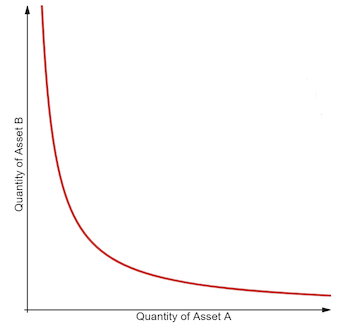
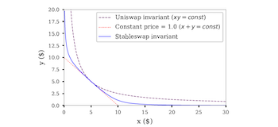
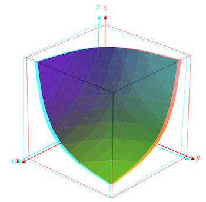
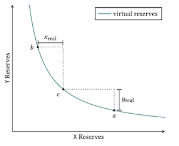
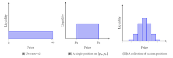

# Awesome AMM
### List of AMM and Orderbook Resources

An overview of the prominent designs and large implementations

# Automated Market Makers 
## History 

A collection of the earliest posts regarding what came to be the automated market maker and it's many variations
- [Vitalik: Let's run on-chain decentralized exchanges the way we run prediction markets](https://www.reddit.com/r/ethereum/comments/55m04x/lets_run_onchain_decentralized_exchanges_the_way/)
- [Martin Köppelmann: Gnosis Market Maker Orderbook](https://forum.gnosis.io/t/market-maker-order-book/19)
- [Nick Johnson: Euler](https://www.reddit.com/r/ethereum/comments/54l32y/euler_the_simplest_exchange_and_currency/)
- [Alan Lu: Building a Decentralized Exchange in Ethereum](https://blog.gnosis.pm/building-a-decentralized-exchange-in-ethereum-eea4e7452d6e)

A collection of popular iterations of various designs (listed below)

- [Kyber](https://kyber.network/)
	- [Whitepaper](https://files.kyber.network/Kyber_Protocol_22_April_v0.1.pdf)
	- [Dynamic Automated Market Making](https://files.kyber.network/DMM-Feb21.pdf)
- [Bancor](bancor.network)
	- [Bancor Whitepaper](https://storage.googleapis.com/website-bancor/2018/04/01ba8253-bancor_protocol_whitepaper_en.pdf)
	- [Bancor v2.1 Economic Analysis](https://drive.google.com/file/d/1en044m2wchn85aQBcoVx2elmxEYd5kEA/view)
	- [Bancor V3](https://drive.google.com/drive/folders/1TUNF7gOFitTkl52-PGqS4m28edp-eyst)
	- [Impermanent Loss in "Concentrated Liquidity" AMMs](https://arxiv.org/abs/2111.09192)
- [Uniswap](https://uniswap.org/)
	- [Uniswap V1 Documentation](https://docs.uniswap.org/protocol/V1/introduction)
	- [Uniswap V2 Whitepaper](https://uniswap.org/whitepaper.pdf)
	- [Uniswap V2 Documentation](https://docs.uniswap.org/protocol/V2/introduction)
	- [Uniswap V3 whitepaper](https://uniswap.org/whitepaper-v3.pdf)
	- [Uniswap V3 Documentation](https://docs.uniswap.org/)
		- [Awesome Uniswap V3](https://github.com/GammaStrategies/awesome-uniswap-v3)
- [Curve](https://curve.fi)
	- [Curve Stableswap Whitepaper](https://curve.fi/files/stableswap-paper.pdf)
	- [Curve Crypto Pools Whitepaper](https://curve.fi/files/crypto-pools-paper.pdf)
- [Balancer](https://balancer.fi)
	- [Balancer Whitepaper](https://balancer.fi/whitepaper.pdf)

## Designs
- **Constant Product**   

	Formula: `(R_a - delta_a)(R_b + fees * delta_b) = k`   
	Simplified Formula: `x * y = k`

	Where R_α and R_β are reserves of each asset and γ is the transaction fee. Trading any amount of either asset must change the reserves in such a way that, when the fee is zero, the product R_α*R_β remains equal to the constant k. This is often simplified in the form of x*y=k, where x and y are the reserves of each asset. In practice, because Uniswap charges a 0.3% trading fee that is added to reserves, each trade actually increases k.
	
	

		
	

- **Stableswap (Hybrid)**   

	Where x is the reserves for each asset, n is the number of assets, D is an invariant that represents the value in the reserve, and A is the “amplification coefficient”, which is a tunable constant that provides an effect similar to leverage and influences the range of asset prices that will be profitable for liquidity providers (i.e. the higher the asset volatility, the higher A should be).

	Function: `An^n SUM(x_i) + D = ADn^n + D^(n+1) / n^n ∏ x_i`

	This function acts as a constant sum when the portfolio is balanced and shifts towards a constant product as the portfolio becomes more imbalanced. In effect, the function looks like a “zoomed-in hyperbola”.
	
	

		
	

- **Constant Mean**   

	A constant mean market maker is a generalization of a constant product market maker, allowing for more than two assets and weights outside of 50/50. First introduced by Balancer, constant mean markets satisfy the following equation in the absence of fees:
	
	Formula: `k = ∏_n R^W_i`
	
	where R is the reserves of each asset, W is the weights of each asset, and k is the constant. In other words, in the absence of fees, constant mean markets ensure that the weighted geometric mean of the reserves remains constant.

	

		
	

- **Concentrated Liquidity**    

	The defining idea of Uniswap v3 is concentrated liquidity: liquidity that is allocated within a custom price range. In earlier versions, liquidity was distributed uniformly along the price curve between 0 and infinity.

	The previously uniform distribution allowed trading across the entire price interval (0, ∞) without any loss of liquidity. However, in many pools, the majority of the liquidity was never used.

	Concentrated Liquidity relies on the concept of virtual liquidity which can be read and derived in their [whitepaper](https://uniswap.org/whitepaper-v3.pdf)

	

		
	

	

		
	

Source [Constant Function Market Makers: DeFi’s “Zero to One” Innovation](https://medium.com/bollinger-investment-group/constant-function-market-makers-defis-zero-to-one-innovation-968f77022159)

# Virtual Automated Market Makers 

A virtual automated market maker (vAMM) uses formulas, such as constant product, but *only* as a price discovery mechanism. 

Generally a vAMM product is designed with a "clearing house" or "controller" contract in which all of the collateral deposited is held.

vAMMs are primmarily used for perpetual future contracts in which the collateral in the clearing house backs virtual assets that users can trade. 

Following the release of [Perpetual Protocol's](https://perp.fi) first vAMM there have been many iterations since, particularly with the price discovery mechanism. 

## Resources
- [Drift: dAMM Deep Dive](https://driftprotocol.notion.site/Drift-dAMM-deep-dive-ff154003aedb4efa83d6e7f4440cd4ab)
- [Perpetual Protocol: A deep dive into our vAMM](https://medium.com/perpetual-protocol/a-deep-dive-into-our-virtual-amm-vamm-40345c522eeb)
- [Perpetual Protocol: vAMM Documentation](https://docs.perp.fi/library/litepaper#virtual-automated-market-maker-vamm)
- [Perpetual Protocol V2 Design](https://docs.google.com/document/d/e/2PACX-1vRDdN03IvJFRMLolxBl4Np7OpzmniMXmJO0zQJNmndD1vL3YZ46bVgTc9VTy8KdCD4ZrnwYz7agbJJN/pub)
- [On vAMM's unnecessity for liquidity pool](https://github.com/Qmeasure/vAMM/blob/main/On%20vAMM's%20unnecessity%20for%20liquidity%20pool%20V1.1.pdf)

## Products 
- [Perpetual Protocol](https://perp.com)
	- [Documentation](https://support.perp.com/hc/en-us)
- [Drift](https://drift.trade)
	- [Documentation](https://docs.drift.trade/)
	- [Litepaper](https://uploads-ssl.webflow.com/611580035ad59b20437eb024/61293b57e3103934ddc5535f_v0%20Devnet%20Feature%20Paper%20-%20Revision%201.1.pdf)
- [Rage](https://rage.trade)
	- [Documentation](https://docs.rage.trade/)
	- [The perpetual pvp ponzi](https://medium.com/@ragetrade/the-perpetual-pvp-ponzi-beaff4a0c662)
- [Hubble](https://hubble.exchange/)
	- [Documentation](https://learn.hubble.exchange/)
	- [Litepaper](https://learn.hubble.exchange/hubble-technical-docs/litepaper)
	- [CurveCrypto Invariant for a vAMM](https://experienced-healer-088.notion.site/Hubble-vAMM-CurveCrypto-Invariant-a37aa328c0104106a3047e85d8f08dd5)
- [NFT Perp](https://nftperp.xyz/)
	- [Documentation](https://nftperp.notion.site/nftperp/nftperp-xyz-2b456a853321481bac47e5a1a6bbfd4e)
	- [Technical Documentation](https://nftperp.notion.site/Technical-Stuff-8e4cb30f08b94aa2a576097a5008df24)

# Derivatives 
- Concentrated Liquidity and Option Payoffs
	- [Uniswap V3 LP Tokens as Perpetual Put and Call Options](https://lambert-guillaume.medium.com/uniswap-v3-lp-tokens-as-perpetual-put-and-call-options-5b66219db827)
	- [Synthetic Options and Short Calls in Uniswap V3](https://lambert-guillaume.medium.com/synthetic-options-and-short-calls-in-uniswap-v3-a3aea5e4e273)
	- [A Guide for Choosing Optimal Uniswap V3 LP Positions, Part 1](https://lambert-guillaume.medium.com/a-guide-for-choosing-optimal-uniswap-v3-lp-positions-part-1-842b470d2261)
	- [How to Create Perpetual Options in Uniswap v3](https://lambert-guillaume.medium.com/how-to-create-a-perpetual-options-in-uniswap-v3-3c40007ccf1)
	- [Understanding the Value of Uniswap v3 Liquidity Positions](https://lambert-guillaume.medium.com/understanding-the-value-of-uniswap-v3-liquidity-positions-cdaaee127fe7)
	- [Pricing Uniswap v3 LP Positions: Towards a New Options Paradigm?](https://lambert-guillaume.medium.com/pricing-uniswap-v3-lp-positions-towards-a-new-options-paradigm-dce3e3b50125)
	- [On-chain Volatility and Uniswap v3](https://lambert-guillaume.medium.com/on-chain-volatility-and-uniswap-v3-d031b98143d1)
	- [Calculating the Expected Value of the Impermanent Loss in Uniswap](https://lambert-guillaume.medium.com/an-analysis-of-the-expected-value-of-the-impermanent-loss-in-uniswap-bfbfebbefed2)
	- [How to deploy delta-neutral liquidity in Uniswap — or why Euler Finance is a game changer for liquidity providers](https://lambert-guillaume.medium.com/how-to-deploy-delta-neutral-liquidity-in-uniswap-or-why-euler-finance-is-a-game-changer-for-lps-1d91efe1e8ac)
	- [Designing a constant volatility AMM](https://lambert-guillaume.medium.com/designing-a-constant-volatility-amm-e167278b5d61)
	- [Panoptic](https://www.panoptic.xyz/)
		- [Whitepaper](https://arxiv.org/pdf/2204.14232.pdf)
- Replicated Market Makers
	- [Replicating Monotonic Payoffs Without Oracles](https://arxiv.org/abs/2111.13740)
	- [Replicating Portfolios: Constructing Permissionless Derivatives](https://arxiv.org/abs/2205.09890)
	- [The Replicating Portfolio of a Constant Product Market](https://papers.ssrn.com/sol3/papers.cfm?abstract_id=3550601)
	- [The Replicating Portfolio of a Constant Product Market with Bounded Liquidity](https://papers.ssrn.com/sol3/papers.cfm?abstract_id=3898384)
	- [Primitive](https://primitive.finance)
		- [Whitepaper RMM 01](https://primitive.xyz/whitepaper-rmm-01.pdf)
		- [RMM Primer](https://primitive.mirror.xyz/Audtl29HY_rnhN4E2LwnP7-zjDcDGAyXZ4h3QpDeajg)
		- [Library](https://primitive.xyz/library)
		- [Learn](https://primitive.xyz/learn)
- Other use cases of AMMs for pricing
	- [Voltz](https://www.voltz.xyz/)
		- [Litepaper](https://www.voltz.xyz/litepaper)
		- [Documentation](https://docs.voltz.xyz/getting-started/protocol-overview)

# Options AMMs

There have been various implementations for an AMM that can be used for buying and selling of options.

- [Hegic](https://www.hegic.co/)
	- [Whitepaper](https://github.com/hegic/whitepaper/blob/master/Hegic%20Protocol%20Whitepaper.pdf)
	- [cryptoanonsense: the story behind hegic](https://github.com/hegic/cryptoanonsense/blob/main/%5BBOOK%5D%20CRYPTO%20ANONSENSE.pdf)
	- [Hegic v8888](https://github.com/hegic/Hegic-v8888-release-deck/blob/main/Hegic%20V8888%20Release%20Deck.pdf)
- [Pods Finance](https://www.pods.finance/)
	- [Whitepaper](http://web.archive.org/web/20220327082424/https://www.pods.finance/pods_v1_whitepaper.pdf)
	- [Documentation](https://docs.pods.finance/)
- [Premia](https://premia.finance/)
	- [Premia AMM](https://blog.premia.finance/premia-amm-meta-vaults-%EF%B8%8F-2fb021a738d5)
	- [Premia’s Volatility Surface Oracle](https://blog.premia.finance/premias-volatility-surface-oracle-b53adc259e72)
	- [Premia V2](https://blog.premia.finance/premia-v2-features-de41a0f37c3)
	- [Premia V3](https://blog.premia.finance/new-premia-v3-at-first-sight-7acb57aa8231)
	- [Documentation](https://docs.premia.finance/)
- [Kittyswap](https://www.kitten.finance/)
	- [AMM for Lending+Option by Minting Option Tokens using Put-Call Parity](https://kitten-finance.medium.com/kittenswap-7-amm-for-lending-option-by-minting-option-tokens-using-put-call-parity-a6a5df91b28b)
- [Onchain AMM pricing for Options](https://twitter.com/cindyleowtt/status/1391804798089924608)

# Orderbooks 
- [0x Protocol](https://www.0x.org/)
	- [Whitepaper](https://www.0x.org/pdfs/0x_white_paper.pdf)
	- [Documentation](https://docs.0x.org/introduction/welcome)
	- [Market Making in DeFi](https://blog.0x.org/market-making-in-defi/)
	- [Introduction to 0x](https://docs.0x.org/introduction/introduction-to-0x) 
	- [Measuring Hidden Costs of DEX Trades](https://blog.0x.org/measuring-the-impact-of-hidden-dex-costs/)
- [DyDX](https://dydx.exchange)
	- [Whitepaper](https://whitepaper.dydx.exchange/)
	- [Documentation](https://docs.dydx.exchange/)
	- [FAQ](https://dydx.exchange/faq)
- [Serum](https://docs.projectserum.com/)
	- [Whitepaper](https://assets.website-files.com/61382d4555f82a75dc677b6f/61384a6d5c937269dbed185c_serum_white_paper.88d98f84.pdf)
	- [Documentation](https://docs.projectserum.com/serum-ecosystem/build-on-serum/project-ideas-for-serum)
- [Tonic](https://tonic.foundation/)
	- [Documentation](https://docs.tonic.foundation/)
- [Spin](https://spin.fi/)
	- [Documentation](https://docs.spin.fi/)
- [Orderly](https://orderly.network/)
	- [An introduction to Orderly Network](https://medium.com/@orderlynetwork/an-introduction-to-orderly-network-29345314e474)
- [Fusotao](https://www.fusotao.org/)
	- [Whitepaper](https://www.fusotao.org/fusotao-whitepaper.pdf)
	- [Greenbook](https://www.fusotao.org/fusotao-greenbook.pdf)
- [Searcher Limit Order Book](https://jumpcrypto.com/searcher-limit-order-book/)

# AMMs and Orderbooks
- Just and Time Liquidity
	- [First posted about in Hacker News by Doug Colkitt](https://news.ycombinator.com/item?id=26558039)
	- [JIT Liquidity in Crocswap Whitepaper](https://www.crocswap.com/whitepaper)
	- [Quantifyng ‘Just-in-Time’ liquidity in Uniswap v3](https://medium.com/coinmonks/quantifyng-just-in-time-liquidity-in-uniswap-v3-23ac1db729c5)
	- [Impermanent Loss and JIT Liquidity in the Uniswap ETH/USDC 0.3% Pool](https://crocswap.medium.com/impermanent-loss-and-jit-liquidity-in-the-uniswap-eth-usdc-0-3-pool-8fc58c755d7)
	- [Uniswap V3 JITters](https://dune.com/ChainsightAnalytics/Uniswap-v3-Just-in-Time-(JIT)-Liquidity-MEV)
	- [Uniswap V3 JIT Volume](https://dune.com/danrobinson/v3-execution)
	- [Daniel Robinson - Uniswap v3, or How I Learned To Stop Worrying And Love Concentrated Liquidity](https://www.youtube.com/watch?v=mBVgnufwZpA)
- [01 zAMM](https://01exchange.medium.com/introducing-zamm-zeroone-automated-market-maker-41e422550194)
	- Liquidity deposited by stakers is placed as limit orders on the orderbook following the constant product formula
	- Similar to [Raydium](https://raydium.gitbook.io/raydium/) and [Atrix](https://docs.atrix.finance/docs/intro)
	- [How it Works](https://help.01.xyz/en/articles/6362978-how-it-works)
- [Introducing Drift V2: Just in Time Liquidity](https://www.drift.trade/updates/drift-v2#jit-just-in-time-liquidity-mechanism)

## Other 
- [Cowswap](https://cowswap.exchange/)
	- [Documentation](https://docs.cow.fi/)
		- [Coincidence of Wants](https://docs.cow.fi/overview/coincidence-of-wants)
		- [Batch Auctions](https://docs.cow.fi/overview/batch-auctions)
- [Crocswap](https://www.crocswap.com/)
	- [Whitepaper](https://www.crocswap.com/whitepaper)
	- [Impermanent Loss and JIT Liquidity](https://crocswap.medium.com/impermanent-loss-and-jit-liquidity-in-the-uniswap-eth-usdc-0-3-pool-8fc58c755d7)
	- [Stablecoins on Uniswap V3](https://crocswap.medium.com/stablecoins-on-uniswap-v3-25b88ba36bd3)
- [TWAMM](https://www.paradigm.xyz/2021/07/twamm)
	- [TWAMM Research](https://mirror.xyz/0x70626a.eth)
	- [FrankieIsLost/TWAMM](https://github.com/FrankieIsLost/TWAMM)
	- [para-dave/twamm](https://github.com/para-dave/twamm)
- [Sovryn](https://www.sovryn.app/)
	- [Whitepaper](https://github.com/DistributedCollective/sovryn-perpetual-futures/blob/main/docs/SovrynPerpetualsV1_1.9.pdf)
- [Blackholeswap](https://blackholeswap.com)
	- [Whitepaper](https://blackholeswap.com/documents/en.pdf)
- Proactive Market Makers
	- [Dodo](https://dodoex.io/)
		- [Documentation](https://docs.dodoex.io/english/)
	- [Lfinity](https://lifinity.io/)
		- [Introducing Lifinity Protocol](https://medium.com/@lifinity.io/introducing-lifinity-protocol-12ff0f5798c4)
		- [Documentation](https://docs.lifinity.io/)
- [Rainbow Network](https://research.paradigm.xyz/RainbowNetwork.pdf)
- [Polymarket](https://polymarket.com/)
	- [Documentation](https://docs.polymarket.com/)
- [Augur](https://www.augur.net/)
	- [Whitepapers](https://github.com/AugurProject/whitepaper)
- [GooseFX](https://goosefx.io/)
	- [Documentation](https://docs.goosefx.io/goosefx-platform-features/ss-liquidity-provisioning)

## Assorted Reading
- [A window into AMM 2.0 — Introducing Volatility Adjusted Fee](https://medium.com/hydraswap/a-window-into-amm-2-0-introducing-volatility-adjusted-fee-af909b6c8ba5)
- [Introducing Volatility-Adjusted Fees](https://medium.com/@lifinity.io/introducing-volatility-adjusted-fees-cc842c5a3698)
- [The Dominance of Uniswap v3 Liquidity](https://www.paradigm.xyz/2022/05/the-dominance-of-uniswap-v3-liquidity)
- [Uniswap v3: The Universal AMM](https://www.paradigm.xyz/2021/06/uniswap-v3-the-universal-amm)
- [Liquidity Mining on Uniswap v3](https://www.paradigm.xyz/2021/05/liquidity-mining-on-uniswap-v3)
- [Understanding Automated Market-Makers, Part 1: Price Impact](https://www.paradigm.xyz/2021/04/understanding-automated-market-makers-part-1-price-impact)
- [An analysis of Uniswap markets](https://www.paradigm.xyz/2019/11/an-analysis-of-uniswap-markets)
- [AMMs as serviced infrastructure](https://docs.osmosis.zone/overview/#amm-as-serviced-infrastructure)
- [The Economics of Automated Market Makers](https://arxiv.org/pdf/2206.04634.pdf)
- [A General Framework for Impermanent Loss in Automated Market Makers](https://arxiv.org/pdf/2203.11352.pdf)
- [Concentrated Liquidity in Automated Market Makers](https://arxiv.org/pdf/2110.01368.pdf)
- [Optimal Fees for Geometric Mean Market Makers](https://arxiv.org/pdf/2104.00446.pdf)
- [Improved Price Oracles: Constant Function Market Makers](https://arxiv.org/pdf/2003.10001.pdf)
- [Optimal Routing for Constant Function Market Makers](https://arxiv.org/pdf/2204.05238.pdf)
- [When does the tail wag the dog? Curvature and market making](https://arxiv.org/pdf/2012.08040.pdf)
- [Yield Space: An automated Liquidity Provider for Fixed Tokens](https://yield.is/YieldSpace.pdf)
- [Part 1: A brief overview of 1st generation AMMs](https://joecontent.substack.com/p/part-1-a-brief-overview-of-1st-generation)
- [Part 2: A brief look into 2nd generation AMMs](https://joecontent.substack.com/p/part-2-a-brief-look-into-2nd-generation?sd=pf&s=09)
- [Dynamic Curves for Decentralized Autonomous Cryptocurrency Exchanges](https://arxiv.org/abs/2101.02778)
- [Price Discovery and AMMs](https://twitter.com/therobotjames/status/1503474348677824513)
- [Automated Market Makers (AMMs): Versioning Up](https://ambergroup.medium.com/automated-market-makers-amms-versioning-up-2c8a81e9889f)

## Awesome Lists 
- [Awesome AMM Models](https://github.com/Epiisteme/awesome-amm-models)
